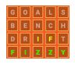

#  WordleSolver 
[Wordle](https://www.powerlanguage.co.uk/wordle/)
([Gurgle](https://github.com/billthefarmer/gurgle)) solver with code
from https://github.com/PoorLazyCoder/Wordle-Solver.

See https://github.com/PoorLazyCoder/Wordle-Solver for explanation.

 

 * Multiple coloured themes

Usually solves [Wordle](href="https://www.powerlanguage.co.uk/wordle)
and [Gurgle](https://github.com/billthefarmer/gurgle) puzzles in four
tries.

Uses solver code from
[Wordle-Solver](https://github.com/PoorLazyCoder/Wordle-Solver).

Letters that are shown green in the game
([Wordle](href="https://www.powerlanguage.co.uk/wordle),
[Gurgle](https://github.com/billthefarmer/gurgle)) go in the first
green row in the correct place. Yellow letters go in the next yellow
rows in the correct place. Letters shown grey go in the last row in
any order.

Then tap either the next button on the keyboard or the solve button in
the toolbar. The next button only works if there is text where the
cursor is, so it can be used to move to the next slot without
triggering a search. The app will show a list of possible next guesses
under the keyboard if on a small phone.
